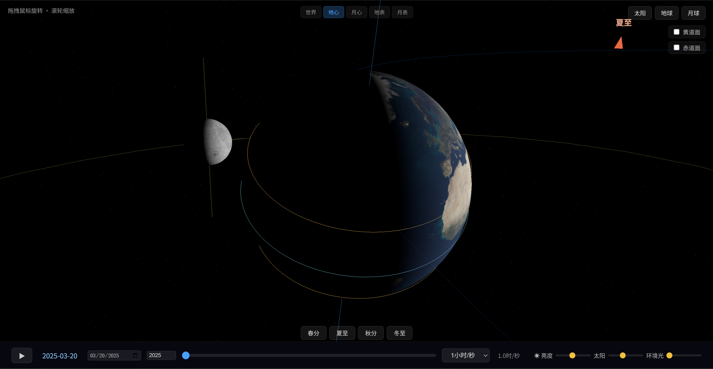
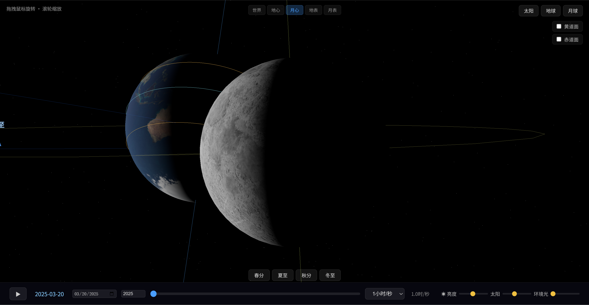
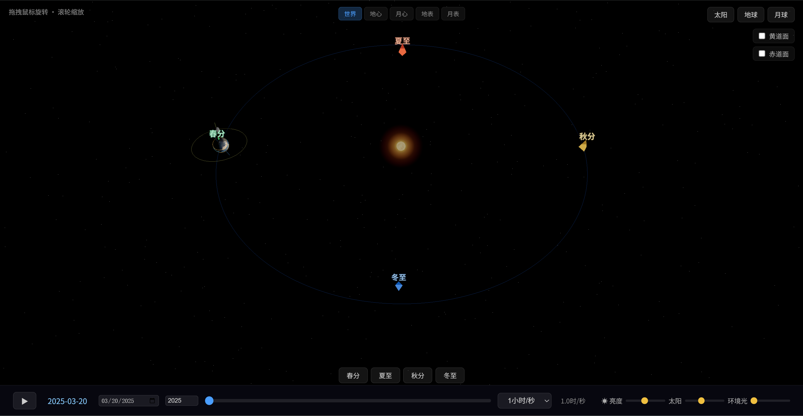
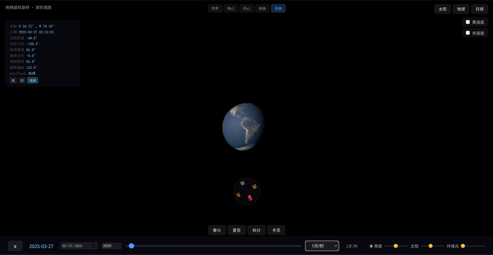

# HelioLuna / 日月 — 三体天文模拟器

[](screenshots/Earth.png)

基于 Three.js + [Astronomy Engine](https://github.com/cosinekitty/astronomy) 的交互式 3D 天文可视化。在地球上仰望太阳轨迹，在月球上回望蓝色母星，在太空中观察日地月系统的精密运动。

## 截图

| 视角 | 预览 |
|---|---|
| 地球表面 |  |
| 月球表面 |  |
| 地球选点 |  |
| 月面选点 |  |
| 四季标记 |  |
| 月面对地跟踪 |  |
| 地面对月跟踪 |  |

## 功能

### 五种观测视角

- **日心（太阳）** — 从太阳位置观察整个内太阳系
- **地心（地球）** — 以地球为中心，观察月球轨道
- **月心（月球）** — 以月球为中心，观察地球
- **地表（地球）** — 站在地球表面任意位置仰望天空
- **月表（月球）** — 站在月球表面仰望星空

### 时间系统

- 以**春分点**为时间轴零点，模拟一个完整的回归年
- 支持任意年份（-9999～9999），年份切换时自动计算该年春分日期作为起点
- 时间轴可拖拽、播放/暂停、多档速度（1秒/秒 ～ 30天/秒 及自定义）
- 日期跳转：通过日期选择器或四季按钮（春分/夏至/秋分/冬至）快速定位
- 播放速度支持任意自定义值（分钟/秒）

### 地表/月表模式

- **点击选点**：鼠标点击天体表面任意位置，自动计算经纬度并标记
- **预设列表**：地球模式提供 18 个世界城市（含时区标识）+ 南北极点；月表模式提供 14 个著名月面坐标（阿波罗/嫦娥着陆点、环形山、月海）
- **确认选点**后进入第一人称地面视角，隐藏轨道线和自转轴

### 地面操控

- **鼠标拖拽**旋转视野（水平 360°，俯仰 0°～90°）
- **滚轮缩放**视野（FOV 10°～90°）
- **三模式自动跟踪**：关闭 / 跟踪太阳 / 跟踪对侧天体（地面对月、月面对地）
- **方位罗盘**：屏幕顶部显示实时方位角

### 天文计算

- 使用 [Astronomy Engine](https://github.com/cosinekitty/astronomy)（VSOP87 + NOVAS）进行高精度星历计算
- 太阳/月亮位置实时计算，精度 ±1 角分
- 月球潮汐锁定：始终同一面朝向地球
- 地球自转：基于格林尼治恒星时 + 太阳赤经赤纬实时确定本初子午线方向
- 地球/月球自转轴正确显示

### 视觉效果

- 昼夜平滑过渡：太阳高度角 < 0° 时自动进入夜间
- 地球模式：淡蓝色天穹在白天淡化星光，夜晚显星
- 月球模式：因无大气层，星光全天全亮
- 太阳光晕：UnrealBloomPass 后期处理
- 四季标记：轨道上显示春分/夏至/秋分/冬至锥体标签
- 行星光照方向随观测位置自动调整

### 调试面板

- 显示北京时间的当前日期时间
- 太阳高度角、方位角
- 对侧天体高度角、方位角
- 相机俯仰角、偏航角
- 自动跟踪模式状态
- 太阳/目标天体屏幕投影坐标

## 快速开始

项目为纯前端应用，无需构建或安装依赖，直接启动静态服务器即可：

```bash
python3 -m http.server 8080
# 浏览器访问 http://localhost:8080
```

或使用 VSCode Live Server、任意 HTTP 服务器。

## 操作说明

### 基础操作

1. 点击顶部模式按钮切换视角（日心 / 地心 / 月心 / 地表 / 月表）
2. 在地心/月心模式下，鼠标拖拽旋转、滚轮缩放
3. 在地表/月表模式下：
   - 点击天体表面选点，或从预设下拉菜单选择
   - 点击「确认选点」进入地面视角
   - 鼠标拖拽旋转视野，滚轮缩放

### 时间控制

- 拖拽时间轴滑块快速浏览
- 点击 ▶/⏸ 播放/暂停
- 修改速度下拉框或「自定义」输入任意速度
- 点击四季按钮跳转至对应节气
- 修改年份输入框切换到任意年份
- 日期选择器在同一年份内跳转

### 自动跟踪

确认选点后，点击调试面板中的三按钮切换跟踪模式：
- **关** — 手动拖拽控制视野
- **日** — 相机自动对准太阳方向，太阳始终在屏幕中央
- **月/地** — 相机自动对准对侧天体（地表→月球，月表→地球）

拖拽视野时自动切换回「关」模式。

### 快捷键

- `D` — 在浏览器控制台打印完整调试状态（含天文计算中间值、屏幕投影坐标等）

## 技术栈

| 技术 | 用途 |
|---|---|
| [Three.js](https://threejs.org/) | 3D 渲染引擎（本地库，无 CDN 依赖） |
| [Astronomy Engine](https://github.com/cosinekitty/astronomy) | 高精度星历计算（VSOP87 + NOVAS，精度 ±1′） |
| JavaScript (ES6) | 全部逻辑在单页面内实现 |
| playwright | E2E 测试（15 个测试用例覆盖全部核心功能） |

## 许可

MIT
